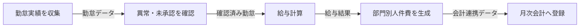
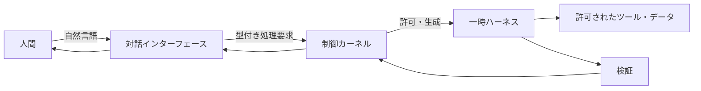
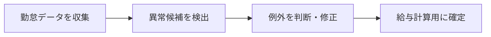
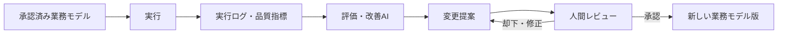

# 業務ノード駆動型・処理単位エージェントハーネス

> 業務を「人が担当している仕事」ではなく、目的・入力・処理・出力・完了条件を持つ構造として捉え直す。  
> その構造を既存の成果物とログから発見し、人間が改善し、実行主体だけを人間からAIへ段階的に置き換えていく。

## このプロジェクトが目指すもの

このプロジェクトは、万能なAIエージェントを一体つくるものではない。

目指すのは、組織の業務を次の循環で運営できる共通基盤である。

```text
既存の成果物・ログを観測する
          ↓
業務構造をノードと接続関係として推定する
          ↓
現場と設計者がレビューし、改善する
          ↓
承認済みの業務モデルとして固定する
          ↓
安全な部分からAIハーネスへ実行を移管する
          ↓
実行ログと評価結果から次の改善案を作る
          ↓
人間が判断し、新しい版へ更新する
```

これは単体の自動化ツールではなく、**業務を発見・設計・実行・評価・統治するための業務運営OS**である。

---

## なぜこの構造が必要なのか

現在の業務自動化は、多くの場合「目の前の作業をAIにやらせる」ことから始まる。

この方法では、個別の改善はできても、組織全体へ広げる段階で次の問題が起きる。

- 業務ごとに仕様の書き方が異なり、再利用できない
- 現場へ一から業務を書き出させるため、棚卸しだけで止まる
- フロー図、手順書、スプレッドシート、実際の運用が一致しない
- 一つのAIが会話、分析、実行、評価のすべてへ手を出す
- 「調べてほしい」という依頼から、AIが勝手に実行を始める
- 小さな自動化を増やしても、全体のどこを置き換えたのか分からない
- 実行結果が共通形式で記録されず、改善へつながらない
- 特定のモデルや製品へ設計全体が依存する

必要なのは、個別自動化の集合ではない。

**業務の意味、業務の構造、実行主体、AIの権限、レビュー、ログ、変更管理を分離し、それらを共通形式で接続する全体設計**である。

---

## 中核となる考え方

### 1. 業務と実行主体を分離する

業務は、人間の職務名や担当者名から定義しない。

先に「何のために、何を受け取り、何を行い、何を生み出し、どの状態になれば完了なのか」を定義する。その後で、誰または何が実行するかを割り当てる。

```text
業務の意味        実行主体
──────────        ──────────
目的              人間
入力              既存システム
処理      +       AIハーネス
出力              人間とAIの混成
完了条件          未割当
```

この分離により、業務の意味を保ったまま、実行主体だけを段階的に差し替えられる。

### 2. 業務の最小単位を「ノード」として固定する

すべての業務ノードは、次の六項目を持つ。

| 項目 | 問い |
|---|---|
| 目的 | なぜこの処理が存在するのか |
| 入力 | 何を受け取れば開始できるのか |
| 処理 | 入力をどのように変換するのか |
| 出力 | 次へ何を渡すのか |
| 完了条件 | 何をもって正常完了とするのか |
| 実行主体 | 人間、システム、AI、混成の誰が行うのか |

この六項目を、業務モデルの**不変コアスキーマ**とする。

業務の内容、ノードの数、接続、階層、実行主体は何度でも変更できる。一方、六項目そのものを日常的な議論の中で勝手に増減させない。

> **スキーマは安定させ、モデルは反復的に変える。**

### 3. ノードを接続し、業務を地図として表す

一つの業務は、一枚の手順書ではなく、複数のノードとエッジからなるグラフとして表現する。



入力が複数ある場合も、出力が複数へ分かれる場合も、ノード自体の形式は変えず、接続関係を増やして表す。

上位の業務は、内部に下位ノードの地図を持つ「複合ノード」として扱う。

```text
原子処理
  └─ 業務プロセス
      └─ チーム機能
          └─ 部署ケーパビリティ
              └─ 会社の価値流
                  └─ 企業グループの運営モデル
```

同じ構造を異なる粒度へ再帰的に適用することで、チームから企業グループまで一つの考え方で扱える。

---

## 白紙から業務を書かせない

業務の棚卸しを、現場担当者へゼロから依頼しない。

業務はすでに、次の場所へ痕跡を残している。

- 完成した成果物
- 元データと処理後データ
- メールやチャットの依頼・回答・申し送り
- スプレッドシートや台帳の更新履歴
- ファイルの作成・変更履歴
- 勤怠、給与、会計、顧客管理などのシステムイベント
- 承認、差戻し、取消、再処理の履歴
- エラー記録、例外対応、問い合わせ
- マニュアル、規程、チェックリスト

AIは、これらの証跡から仮のノードと接続関係を生成する。

人間の役割は、白紙に正解を書くことではなく、AIが示した仮説に対して次を判断することである。

- ここが違う
- この処理が抜けている
- この二つは分けるべきである
- この二つは一つにできる
- この承認は不要である
- この例外は証跡だけでは見えない
- この判断はAIへ渡せない

業務設計を「記述する作業」から、**観測されたモデルを訂正し、改善する作業**へ変える。

---

## 人間が理解するための表現

正本データは構造化して保持するが、人間にIDやJSONを直接操作させない。

人間が扱う画面は、主に次の三つとする。

### 業務マップ

業務全体の位置関係、分岐、受け渡し、ボトルネックを視覚的に確認する。

### ノードカード

一つのノードを、六項目と証跡、確認状態、実行履歴の単位で開く。

```text
┌──────────────────────────────────┐
│ 勤怠実績を給与計算用に確定する              │
├──────────────────────────────────┤
│ 目的：給与計算へ正確な実績を渡す            │
│ 入力：打刻、申請、所属情報                    │
│ 処理：欠損・矛盾・未承認を確認し確定する      │
│ 出力：確定勤怠データ                          │
│ 完了：未承認・矛盾・欠損が0件                 │
│ 実行：人間 + 異常検出AI                       │
└──────────────────────────────────┘
```

### 一覧表

ノードを横断して比較し、抜け、重複、未確認、実行主体、改善優先度を確認する。

マップ、カード、一覧表は別々の資料ではない。すべて同じ正本データを異なる見え方で表示する。

---

## AIエージェントではなく、処理単位のハーネスを動かす

### ノードは仕様、ハーネスは実行環境

ノードは「何をする業務か」を定義する。

ハーネスは、そのノードまたはサブ処理をAIが安全に実行するための、次の要素を束ねた実行契約である。

- 対象ノードと版
- 実行モード
- 使用するモデルの能力要件
- 使用できるスキル
- 使用できるツール
- 読み書きできるデータ範囲
- 入力契約と出力契約
- 完了条件の検証方法
- 承認ポイント
- 実行時間、回数、費用の上限
- ログとして残す項目
- 失敗時の停止、再試行、差戻し
- 実行終了後の資格情報と作業領域の破棄

### 一処理・一モード・一権限境界

一回のハーネス実行は、次の境界へ拘束する。

1. 一つの処理
2. 一つの対象ノードまたはサブ処理
3. 一つのモード
4. 一つの権限範囲
5. 一つの完了判定
6. 一つのログ系列

観測用のハーネスは観測だけを行う。実行用のハーネスは許可された処理だけを行う。評価用のハーネスは改善案を作るが、本番設定を変更しない。

### ハーネスは短命である

実行要求を受けるたびに、必要なハーネスを生成する。

処理が完了したら、権限、認証情報、一時状態、作業領域を破棄する。次の処理へ権限や状態を持ち越さない。

```text
処理要求
   ↓
対象ノード・版・モードを固定
   ↓
必要なモデル・スキル・権限を束ねる
   ↓
一時ハーネスを起動
   ↓
処理・検証・ログ記録
   ↓
結果を返却
   ↓
権限と作業状態を破棄
```

常駐する万能エージェントへ全権限を与えるのではなく、**必要な処理のためだけに、必要な能力と権限を持つ短命な実行体を立ち上げる**。

---

## 対話するAIと実行するAIを分ける

人間とのインターフェースは、自然なチャットでよい。ただし、会話しているAI自身へ業務実行権限を持たせない。

対話AIの役割は次に限定する。

- 人間の意図を理解する
- 対象となる業務やノードを特定する
- 不足情報を整理する
- 観測、提案、実行、検証のどのモードかを判定する
- 型付きの処理要求を制御カーネルへ提出する
- 実行結果を人間へ説明する



会話が自然であることと、実行権限が自由であることは別である。

対話は柔軟にし、実行は厳格にする。

---

## モデルより下に、非エージェント型の制御カーネルを置く

AIに「やってはいけない」と指示するだけでは、制御にならない。

権限や状態遷移は、モデルの判断ではなく、決定論的なコードと設定で強制する。

制御カーネルが担当するものは次である。

- 認証と認可
- 対象ノードと版の固定
- 実行モードの固定
- 入出力スキーマの検証
- ハーネス定義の選定
- 承認ゲート
- 実行予算、時間、再試行回数
- 資格情報の発行と失効
- ログの強制記録
- 実行停止と緊急停止
- 変更の版管理

AIは候補を提案できるが、制御カーネルの判定を上書きできない。

> **安全性はモデルの善意や指示遵守能力ではなく、外部構造で保証する。**

---

## フェーズごとにAIの役割を分ける

AIの役割は、モデルの上下関係ではなく、業務ライフサイクル上の責任で分ける。

### 1. 現状把握・設計フェーズ

AIは業務を実行しない。

- 証跡を収集する
- イベントと成果物を抽出する
- 仮ノードと仮エッジを作る
- 欠落、矛盾、重複を示す
- 分割、統合、削除、順序変更を提案する
- 人間のレビュー結果をモデルへ反映する

### 2. 実行・運用フェーズ

承認済みのノードに対して、実行ハーネスが処理する。

- 指定された入力だけを受け取る
- 許可されたスキルとツールだけを使う
- 完了条件に沿って処理する
- 実行ログを残す
- 検証に合格した出力だけを次へ渡す

### 3. 評価・進化フェーズ

評価AIは、実行結果を入力として改善案を作る。

- 処理時間、待ち時間、費用を測る
- ミス、差戻し、再処理を集計する
- 人間の修正箇所を分析する
- ノード、ハーネス、完了条件の改善案を作る
- 改善前後の影響を比較する

ただし、評価AIは本番モデルを直接変更しない。変更は提案として出し、人間のレビューと承認を通す。

---

## 人間の責任は三層に分ける

### 実行担当者

日々の業務と現実を知る人。

- AIが推定した業務が現実と一致しているかを見る
- 抜けた手順、例外、暗黙知を補う
- 出力が実際に使えるか判断する
- AIへ渡せない判断を明示する

### 業務評価・設計者

一つの業務フローや部署機能を横断して見る人。

- ノードを分割、統合、削除する
- 重複、待ち、手戻り、過剰承認を減らす
- 完了条件と品質基準を整える
- 人間とAIの境界を設計する
- 自動化の優先順位を決める

### 標準化・意思決定者

複数部署、複数会社へ影響する判断を行う人。

- 共通ルールと共通語彙を決める
- 権限、監査、リスク許容度を決める
- 共通ハーネスの標準化を承認する
- 投資と導入順序を決める
- コアスキーマや制御ルールの変更を承認する

同じ人が複数の役割を兼ねてもよい。ただし、どの役割として判断したかは記録する。

---

## 業務レビューとアーキテクチャレビューを分ける

業務の中身を変える議論と、業務を表す形式そのものを変える議論は別である。

| レビュー | 主な問い | 変更対象 |
|---|---|---|
| 現実一致レビュー | 実際の業務と合っているか | 六項目の内容、接続、例外 |
| 業務設計レビュー | 分ける、まとめる、なくすべきか | ノード構造、順序、実行主体 |
| 標準化レビュー | 他部署・他社へ共通化できるか | 標準業務、共通ハーネス、指標 |
| アーキテクチャレビュー | 基本形式を変える必要があるか | コアスキーマ、ログ規格、制御規則 |

現場の議論中に六項目を勝手に七項目、八項目へ増やさない。

新しい概念が必要になった場合は、業務モデルへ直接追加せず、**スキーマ変更提案**として別のレビュー経路へ送る。

---

## 人間からAIへの移管は、ノード単位で段階的に行う

一つの人間業務を、そのまま一つのAIへ置き換えられるとは限らない。

例えば、元の業務が次の一ノードだったとする。

```text
勤怠を確認し、修正し、給与計算用に確定する
```

このノードを分解すると、次のようになる。



初期段階では、すべて人間が行う。

次に「異常候補を検出する」だけをAIハーネスへ渡す。

その後、十分な精度と統制が確認できれば、「定型的な修正案を作る」まで移管する。判断や承認は人間に残す。

```text
段階0：人間が全処理を実行
段階1：AIが情報収集・候補提示
段階2：AIが限定されたサブ処理を実行、人間が承認
段階3：AIが定型処理を自動実行、例外だけ人間へ送る
段階4：承認済み範囲でAIが自律実行、人間は監督・改善
```

自動化率を先に目標にしない。

**責任境界、例外、完了条件、監査可能性を保ったまま、実行主体を一部分ずつ差し替える。**

---

## ログは監査記録であり、改善の入力でもある

すべてのハーネス実行は、共通形式のログを残す。

最低限、次を記録する。

- 何の要求から起動したか
- どのノードと版を実行したか
- どのハーネスと版を使ったか
- どのモデル、スキル、ツールを使ったか
- どの入力を受け取ったか
- 何を出力したか
- 完了条件を満たしたか
- どこで失敗、再試行、差戻しが起きたか
- 何秒、いくら、何回の処理を要したか
- 誰が何を承認したか
- どの操作がポリシーで拒否されたか

ただし、モデルの内部思考をそのまま保存することを目的にしない。

保存するのは、第三者が検証できる構造化された判断根拠、参照した規則、使用した証跡、実行イベントである。

実行ログ、人間のレビュー、品質指標を評価AIへ渡し、改善案を作る。改善案は再び人間の判断へ戻す。



この閉ループによって、業務とAIは勝手に自己改変するのではなく、**観測可能かつ統治された形で進化する**。

---

## モデルは役割ではなく、交換可能な実装である

対話、実行、評価では必要な能力が異なる。

- 対話：文脈理解、曖昧性解消、低遅延
- 実行：ツール利用の正確性、指示遵守、低コスト
- 評価・設計：長文統合、因果分析、矛盾検出
- 大量抽出：定型分類、構造化、低単価
- 機密処理：ローカルまたは閉域での実行

ハーネスは特定のモデル名を前提にしない。必要能力をプロファイルとして定義し、その時点で適切なモデルを割り当てる。

モデルは更新され、価格も能力も変わる。

変えてはいけないのは業務の意味、権限境界、入出力契約、完了条件、ログ、レビュー経路である。

---

## この設計が守る原則

1. **業務を先に定義し、実行主体は後から割り当てる。**
2. **ノードの六項目は固定し、業務モデルの内容だけを反復的に変える。**
3. **業務は白紙から書かず、既存の成果物とログから発見する。**
4. **人間は構造を書くより、AIが生成した構造を訂正・改善する。**
5. **対話、観測、設計、実行、検証、評価を一つのエージェントへ集約しない。**
6. **一回のハーネス実行を、一処理・一モード・一権限境界へ拘束する。**
7. **対話AIには本番業務の直接実行権限を持たせない。**
8. **権限と状態遷移は、AIではなく制御カーネルが強制する。**
9. **実行後は権限と一時状態を破棄する。**
10. **評価AIは改善を提案するが、本番を直接変更しない。**
11. **業務レビューとアーキテクチャレビューを分ける。**
12. **人間からAIへの移管は、ノードを必要に応じて分割し、部分的に進める。**
13. **すべての実行を、再現可能な版と構造化ログへ結び付ける。**
14. **特定モデルや製品ではなく、能力・契約・権限を設計の中心に置く。**
15. **チーム、部署、会社、企業グループへ同じ構造を再帰的に適用する。**

---

## この設計が採らない方法

- 一体の万能AIへ全データと全ツールを与える
- プロンプトだけで安全性を保証する
- 現場へ全業務を一から書き出させる
- フロー図と仕様書と運用データを別々に管理する
- 一つの大きな業務を分解せず、そのままAI化する
- AIが自分で権限やスキルを追加する
- 評価AIが本番業務を自動で書き換える
- モデル固有の能力を前提に業務設計を固定する
- 小さな自動化を全体構造なしに増やし続ける
- 最初から全社業務の完全自動化を狙う

---

## 最初に実装するもの

最初から全機能を実装するのではない。ただし、局所機能だけを作るのでもない。

全体構造を先に固定したうえで、全レイヤーを通る細い縦断実装を一つ作る。

### 最小の縦断MVP

1. 一つの実業務を選ぶ
2. 成果物とログを読取専用で収集する
3. AIが仮ノードと仮エッジを生成する
4. 現場担当者がマップとカードで訂正する
5. 業務評価・設計者が分割、統合、削除を検討する
6. 承認済み業務モデルを版として固定する
7. 一つのサブノードだけを実行ハーネスへ割り当てる
8. 対話AIから型付き処理要求を提出する
9. 制御カーネルが権限とモードを検証する
10. 一時ハーネスが処理し、別工程が完了条件を検証する
11. 実行ログと人間レビューを記録する
12. 評価AIが改善提案を作り、人間が判断する

この一連が端から端まで動けば、その後はノード、ハーネス、対象部署を増やしていける。

---

## 最終的に実現する状態

この設計が定着した組織では、次のことが可能になる。

- 業務が担当者の頭の中ではなく、検証可能な地図として存在する
- 実際の成果物とログから、業務モデルを継続的に更新できる
- 人間とAIの責任境界がノード単位で明確になる
- AIが何をしてよく、何をしてはいけないかを構造で制御できる
- 個別自動化を、部署や会社の全体構造へ接続できる
- 実行結果を共通ログとして比較し、改善へ利用できる
- モデルやベンダーを交換しても、業務設計と統制を維持できる
- 現場、設計者、意思決定者が同じ業務モデルを異なる粒度で見られる
- 人間からAIへの移管を、品質と責任を失わず段階的に進められる
- チームから企業グループまで、同じ原則で業務を管理できる

目標は、人間を一括してAIへ置き換えることではない。

**組織の仕事を構造として理解し、最適な実行主体へ割り当て、観測と判断を通じて継続的に改善できる状態をつくることである。**

---

## 詳細設計

実装に必要なオブジェクト、状態遷移、ハーネス定義、ログスキーマ、レビュー、ロードマップは、次のアーキテクチャ設計書で定義する。

- [`20260824-business-node-driven-agent-harness-architecture-design.md`](./docs/architecture/20260824-business-node-driven-agent-harness-architecture-design.md)