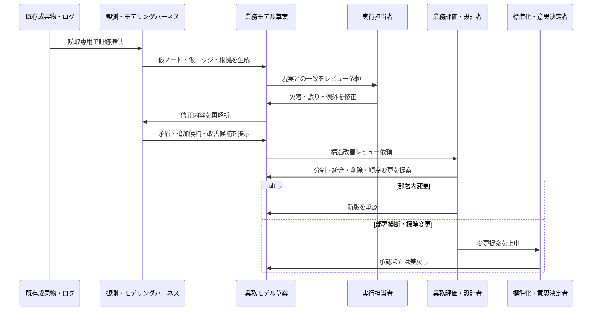
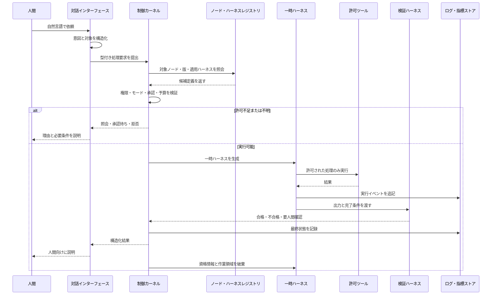
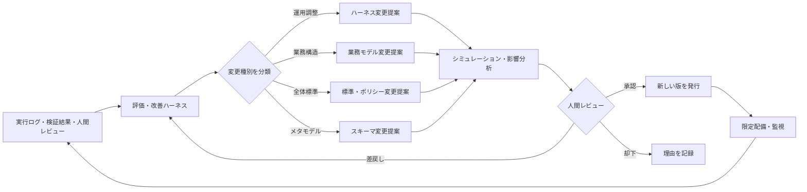
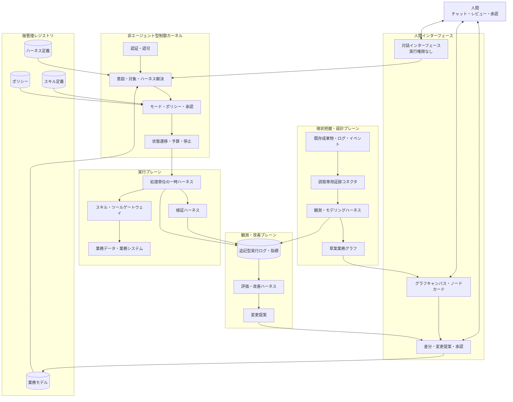

# 業務ノード駆動型・処理単位エージェントハーネス アーキテクチャ設計書

## 0. 文書の目的

本書は、既存業務の成果物・ログ・操作履歴から業務構造を発見し、人間が直感的にレビュー・改善し、その一部を安全にAIエージェントへ移管し、実行結果を使って継続的に改善するための全体アーキテクチャを定義する。

対象は個別の自動化ツールではない。部署、会社、複数会社へ横展開できる、次の共通基盤である。

1. 業務を共通形式で表現するモデル
2. 現状把握と業務改善を支援する仕組み
3. 処理単位でAIを安全に実行するハーネス
4. 人間のレビュー・意思決定・標準化の構造
5. 実行ログを基に継続改善する閉ループ
6. 部署・会社・企業グループまで自己相似的に拡張できる管理体系

本書で最も重要な結論は、次の四点である。

- **業務の意味を定義する「ノード」と、AIを動かす「ハーネス」を分離する。**
- **ノードの意味スキーマは六項目に固定し、業務内容と接続関係だけを反復的に修正する。**
- **万能エージェントを常駐させず、一つの処理・一つのモード・一つの権限範囲ごとに短命なハーネスを生成して破棄する。**
- **モデルやエージェントより下位に、権限・状態遷移・スキーマ・ログを強制する非エージェント型の制御カーネルを置く。**

---

## 1. 背景と問題設定

### 1.1 解決したい問題

一般的な業務自動化は、次の理由で拡張時に破綻しやすい。

- 個別業務ごとに異なる形式で仕様書を作り、横展開できない
- 現場へ業務を書き出させる負担が大きく、着手時点で停滞する
- 実際にはメール、チャット、台帳、ファイル、システムログに業務の痕跡があるのに再入力を求めている
- フロー図、表、個別仕様書が分離し、どれが正しいか分からなくなる
- 対話、分析、実行、評価を一つのAIエージェントに持たせ、役割と権限が混ざる
- 「現状を調べる」依頼に対してAIが実システムを操作するなど、モード逸脱が起きる
- 実行ログの形式が揃っておらず、改善エージェントが学習・評価できない
- 業務モデルの修正と、モデルの形式そのものの変更が同じレビュー経路に流れる
- 小さな自動化を増やしても、組織全体の構造に接続できない
- モデル名や特定製品を前提にすると、モデル更新やベンダー変更に耐えない

### 1.2 設計上の問い

本書は、次の問いに一貫した回答を与える。

- 業務を表す最小単位は何か
- 最小単位が持つべき不変の項目は何か
- 複数入力・複数出力・分岐・階層化をどう表現するか
- 既存の成果物やログから、どのように業務モデルを推定するか
- 人間が直感的に理解・修正できる表示形式は何か
- 業務モデルのレビューと、アーキテクチャのレビューをどう分けるか
- 現状把握用AIと実行用AIをどう分離するか
- 一つのノードと一つのハーネスは、どのような関係になるか
- 人間の業務を段階的にAIへ置き換える際、どこでノードを分割するか
- 実行エージェントが残すべきログは何か
- 部署、会社、企業グループへ広げても形式を崩さないために何を固定するか
- メタ設計が無限に上位化する問題を、どこで止めるか

---

## 2. 設計目標と非目標

### 2.1 設計目標

本アーキテクチャは、以下を満たさなければならない。

| 目標 | 意味 |
|---|---|
| 認知容易性 | 現場担当者がIDやYAMLを直接操作せず、地図とカードで理解・修正できる |
| 証跡起点 | 既存の成果物、ログ、イベントから業務モデルの草案を作れる |
| 反復可能性 | 一度で確定せず、推定・レビュー・再推定を何度でも安全に回せる |
| スキーマ安定性 | 業務を修正しても、ノードの基本形式は勝手に増減しない |
| 実行分離 | 対話、観測、モデリング、実行、評価を別ハーネスとして隔離する |
| 最小権限 | 各ハーネスは一つの処理に必要な権限だけを持つ |
| 追跡可能性 | すべての推定、変更、実行結果を証跡と版に結び付けられる |
| 段階移行 | 人間実行から支援、部分自動化、限定自律へ段階的に移行できる |
| 再利用性 | ノード、スキル、ハーネス定義を別部署・別会社へ再利用できる |
| モデル交換性 | AIモデルを役割別の能力プロファイルとして交換できる |
| 組織拡張性 | チーム、部署、会社、企業グループに同じ原則を適用できる |
| 統治可能性 | 業務変更、ハーネス変更、スキーマ変更を別の承認経路で管理できる |

### 2.2 非目標

以下は、本設計の目標ではない。

- 最初から全業務を完全自動化すること
- 一つの万能エージェントに全データ・全ツール・全権限を与えること
- プロンプトだけで権限や安全性を保証すること
- 現場担当者に全業務を一から棚卸しさせること
- すべての業務を一つの巨大フロー図に平坦化すること
- 特定のAIモデル、コーディングエージェント、クラウド製品へ固定すること
- AIが自動で業務標準や権限方針を変更すること
- AIの内部思考過程を監査ログとして保存すること

---

## 3. アーキテクチャの基本原則

### 3.1 業務先行、実行主体後置

最初に「誰がやるか」から設計しない。先に、業務として何を入力し、何を変換し、何を出力し、何をもって完了とするかを定義する。

実行主体は最後に割り当てる。したがって、人間からAIへの移行時に、業務の意味を保ったまま実行主体を差し替えられる。

### 3.2 スキーマ不変、モデル可変

- ノードが持つ六項目は、通常の業務レビューでは変更しない
- ノードの内容、数、接続、階層、実行主体は変更できる
- 六項目そのものを変更する場合は、業務改善ではなくスキーマ変更として別経路で審査する

### 3.3 証跡から発見し、人間が訂正する

業務モデルは現場へ白紙から書かせない。既存の成果物、メール、チャット、台帳、システムイベント、ファイル更新履歴などからAIが草案を作り、人間は「違う」「足りない」「まとめる」「分ける」をレビューする。

### 3.4 対話と実行を分離する

人間と会話するAIは、業務システムを直接操作しない。対話AIが行うのは、意図の理解、対象ノードの特定、必要情報の確認、処理要求の構造化、ハーネス起動要求の提出までである。

実操作は、制御カーネルが許可した短命な実行ハーネスだけが行う。

### 3.5 一処理・一モード・一権限境界

一つのハーネス実行は、次を同時に満たす。

- 一つの明確な目的
- 一つの対象ノードまたは対象サブノード
- 一つのモード
- 一つの権限境界
- 一つの完了判定
- 一つの実行ログ系列

観測しながら実行する、評価しながら本番設定を変更する、といったモード混在を禁止する。

### 3.6 一時生成・一時権限・実行後破棄

実行ハーネスは要求ごとに生成し、処理完了後に終了する。認証情報、作業状態、ツール権限を恒久的に持ち越さない。継続すべき情報は、明示された出力、イベントログ、承認済みメモリだけに限定する。

### 3.7 変更は直接反映せず、提案として流す

評価・改善エージェントは、実行ログを見て改善案を作れるが、本番業務モデル、ハーネス、権限、スキーマを直接変更しない。変更提案を作成し、対象に応じた人間レビューを経て新版として反映する。

### 3.8 全体構造を先に固定し、実装は薄い縦断スライスから始める

「小さな機能を無秩序に増やす」のではなく、最初に全レイヤーを定義する。その上で、各レイヤーを最小限ずつ実装し、一つの業務を端から端まで通す。

これは大規模一括実装ではない。**全体アーキテクチャを先に固定したうえで、全レイヤーを通る細い縦断実装を作る**方針である。

### 3.9 モデル名ではなく能力プロファイルで割り当てる

対話、実行、評価・設計では必要能力が異なる。アーキテクチャ上はモデル名を固定せず、次の能力プロファイルで定義する。

- 対話・意図理解プロファイル
- 高信頼ツール実行プロファイル
- 長文・深い評価推論プロファイル
- 低コスト大量処理プロファイル
- 機密データ向けローカル実行プロファイル

実際のモデル名は配備設定で差し替える。

### 3.10 最下層には非エージェント型の制御カーネルを置く

メタ設計をAIへ委ね続けると、さらにそのAIを統治するAIが必要になり、無限後退する。これを止めるため、次はLLMではなくコードと設定で強制する。

- 認証と認可
- モード制約
- スキーマ検証
- 状態遷移
- ハーネス生成と停止
- 実行予算
- 監査ログ
- 承認ゲート
- 緊急停止
- バージョン固定

この制御カーネルが、アーキテクチャの非再帰的な根である。

---

## 4. 全体を理解するための三軸モデル

複数の「レイヤー」を一つの上下構造に詰め込むと、業務の粒度、人間の権限、AIのフェーズが混ざる。本設計では、三つの独立軸として扱う。

### 4.1 軸A：業務モデルの深さ・範囲

| レベル | 対象 | 例 |
|---|---|---|
| A0 | 証跡・イベント | メール、勤怠レコード、台帳行、ファイル更新、承認イベント |
| A1 | 原子ノード | 勤怠異常を検出する、売上明細を検証する |
| A2 | 複合プロセス | 給与計算を完了する、月次締めを完了する |
| A3 | ケーパビリティ・価値流 | 労務管理、財務会計、採用、購買 |
| A4 | 組織スコープ | チーム、部署、会社、企業グループ |

A1からA4は同じ六項目を持つ複合ノードとして再帰的に表現できる。上位ノードを開くと、下位のノードグラフが現れる。

### 4.2 軸B：ライフサイクル

| フェーズ | 目的 | 主なAI |
|---|---|---|
| B1 現状把握・設計 | 証跡から現状を推定し、可視化・改善する | 観測、抽出、モデリング、レビュー支援 |
| B2 実行・運用 | 承認済みノードを人間またはAIが実行する | 対話、ルーティング、実行、検証 |
| B3 評価・進化 | ログと指標から改善案を作り、版を更新する | 評価、比較、異常検知、改善提案 |

### 4.3 軸C：人間の責任・権限

| 役割 | 主な責任 |
|---|---|
| C1 実行担当者 | 現実の業務、成果物、例外、暗黙の手順が正しいかを判断する |
| C2 業務評価・設計者 | ノードの分割、統合、削除、順序変更、完了条件、統制を設計する |
| C3 標準化・意思決定者 | 部署横断標準、権限、投資、スキーマ、例外許容を決定する |

同じ人が複数役割を兼務することはできる。ただし、システム上の承認行為は役割ごとに区別して記録する。

### 4.4 三軸の使い方

すべての作業やエージェントを、三軸の座標で表せる。

| 例 | 深さ・範囲 | ライフサイクル | 人間の責任 |
|---|---|---|---|
| 勤怠ログから手順を推定する | A0〜A1 | B1 | C1が確認 |
| 月次締めフローを再設計する | A2〜A3 | B1 | C2が主導 |
| 仕訳CSVを会計へ登録する | A1 | B2 | C1または委譲済みAI |
| 部署共通の承認基準を変更する | A3〜A4 | B3 | C3が決定 |
| ノードの六項目を変更する | メタモデル | B3 | C3によるアーキテクチャ審査 |

この三軸により、「どのレイヤーの話をしているか」を会話中に見失いにくくなる。

---

## 5. 基本オブジェクトモデル

### 5.1 第一級オブジェクト

本アーキテクチャは、次のオブジェクトで構成する。

| オブジェクト | 役割 |
|---|---|
| ノード | 一つの目的を持ち、入力を処理して出力し、完了判定できる業務単位 |
| エッジ | ノード間で渡る成果物、イベント、制御、承認、例外の関係 |
| 証跡 | ノード・エッジの存在や内容を裏付ける実データ |
| 業務グラフ | ノード、エッジ、証跡参照、階層をまとめた業務モデル |
| 実行主体バインディング | ノードを人間、既存システム、AIハーネス、または混成で実行する割当 |
| ハーネス定義 | ある処理をAIが安全に実行するための版管理されたテンプレート |
| ハーネス実行 | 一回の要求に対して生成され、完了後に破棄される実行インスタンス |
| 実行イベント | 入力受領、ツール実行、出力生成、検証、失敗、承認などの記録 |
| 変更提案 | 業務モデル、ハーネス、ポリシー、スキーマへの変更要求 |
| レビュー | 変更提案に対する確認、修正、承認、却下、差戻しの記録 |

### 5.2 業務の最小単位：原子ノード

原子ノードは、次の条件を満たす最小単位とする。

> **一つの責任・権限境界の下で割り当て、実行し、観測し、完了を判定できる一つの変換単位。**

単に「細かい作業」である必要はない。重要なのは、独立して次を決められることである。

- 誰または何に割り当てるか
- どの入力を渡すか
- 何を許可するか
- どの出力を受け取るか
- 成功、失敗、未完了をどう判定するか
- どのログを残すか

### 5.3 ノードの不変コアスキーマ

ノードの業務的意味は、以下の六項目だけで構成する。

| 項目 | 定義 | 設計上の注意 |
|---|---|---|
| 1. 目的 | なぜこのノードが存在するか | 上位目的への寄与を一文で表す |
| 2. 入力 | 処理開始に必要なデータ、成果物、イベント、状態 | 複数可。参照元を特定できること |
| 3. 処理 | 入力を出力へ変換する規則、判断、作業 | 手順の詳細は折り畳み可能。目的や出力と混同しない |
| 4. 出力 | 次工程や利用者へ渡す成果物、状態、イベント | 複数可。出力ごとに接続先を持てる |
| 5. 完了条件 | このノードが正常に完了したと判定する条件 | 実行単位で検証可能な形にする |
| 6. 実行主体 | 人間、既存システム、AIハーネス、混成、未割当 | 人名ではなく役割・バインディングとして管理する |

原則は次のとおりである。

- 六項目は通常の業務モデリング中に増減しない
- 複数入力・複数出力は配列として表現する
- 詳細な処理手順は「処理」の内部に階層化する
- KPIや長期成果は、原子ノードの出力ではなく上位プロセスの評価指標として扱える
- 法令、ポリシー、権限はノードの七番目の意味項目にせず、ハーネス・ポリシー層から適用する
- 不明な項目は推測で埋めず、「未確認」として保持する

### 5.4 管理用エンベロープ

実運用にはID、版、証跡、状態が必要である。ただし、これらはノードの業務的意味ではなく管理情報であり、六項目の外側に置く。

| 管理情報 | 用途 |
|---|---|
| node_id | 一意識別 |
| version | ノード定義の版 |
| status | draft、reviewed、approved、active、deprecated |
| scope | チーム、部署、会社などの所属範囲 |
| parent_node_id | 上位複合ノード |
| evidence_refs | 根拠となる成果物・ログ・発言 |
| provenance | AI推定、人間入力、システム生成などの由来 |
| confidence | 推定の確信度。人間確認済みなら別状態で表現 |
| reviewed_by / reviewed_at | レビュー履歴 |
| change_set_id | どの変更提案で更新されたか |
| tags | 検索・分類用の補助情報 |

各六項目の値にも、次の状態を付与できる。

- `unknown`: 根拠不足
- `inferred`: AIまたはルールによる推定
- `confirmed`: 現場担当者が確認
- `conflicted`: 証跡または人間の認識が矛盾
- `deprecated`: 現在は使わない

これにより、初回のAI草案が不完全でも、スキーマを崩さず反復的に精度を上げられる。

### 5.5 エッジの最小スキーマ

ノード同士の接続はノード内部へ埋め込まず、エッジとして独立管理する。

| 項目 | 定義 |
|---|---|
| source_node | 接続元ノード |
| source_output | 接続元のどの出力か |
| target_node | 接続先ノード |
| target_input | 接続先のどの入力か |
| relation_type | data、trigger、approval、feedback、exception |
| condition | 接続が成立する条件 |
| payload | 渡される成果物・イベントの型 |
| evidence_refs | この接続を裏付ける証跡 |

複数の入力や複数の行き先は、エッジを増やして表現する。スプレッドシート上の「前ノードID」「次ノードID」を人間へ直接見せる必要はない。

### 5.6 複合ノードと再帰構造

上位の業務、部署機能、会社機能も、同じ六項目で表現する複合ノードとする。

- 複合ノードの「処理」は、内部のサブグラフ
- 複合ノードの「入力」は、サブグラフへ入る外部入力
- 複合ノードの「出力」は、サブグラフから出る外部出力
- 複合ノードの「完了条件」は、内部ノードの完了状態を集約したもの
- 複合ノードの「実行主体」は、チーム、部署、複数ハーネスのオーケストレーションなど

この自己相似構造により、同じ地図を次の範囲へ拡張できる。

```text
原子作業
  └─ 業務プロセス
      └─ チーム機能
          └─ 部署ケーパビリティ
              └─ 会社の価値流
                  └─ 企業グループの運営モデル
```

### 5.7 ノードの分割・統合基準

#### 分割すべき条件

次のいずれかが変わる場合、原則としてノードを分割する。

- 目的が独立している
- 実行主体または権限境界が変わる
- 独立して利用される中間出力がある
- 完了条件を別々に判定できる
- 失敗、再試行、取消、承認の境界が異なる
- 人間実行とAI実行を分離する必要がある
- 異なるモードのハーネスが必要である

#### 統合を検討できる条件

次をすべて満たす場合、統合を検討できる。

- 中間出力が他で利用されない
- 同じ責任・権限境界で常に連続実行される
- 個別の完了判定や例外処理を必要としない
- 統合後も人間が理解でき、監査・再実行が困難にならない

---

## 6. 人間が扱う表示・編集形式

### 6.1 原則

- 人間の主画面はグラフキャンバスとノードカード
- スプレッドシートは一覧、比較、バルク編集の補助ビュー
- YAMLやJSONはシステム連携・輸出入用であり、日常編集画面にしない
- IDや接続関係は裏側で管理し、人間には線、ラベル、階層として見せる
- 同じデータから、全体図、詳細カード、表、変更差分を生成する
- どのビューから編集しても、同じ正本モデルへ反映する

### 6.2 ノードカード

折り畳み時は認知負荷を抑え、次だけを表示する。

```text
┌──────────────────────────────────┐
│ N-104  勤怠実績を給与計算用に確定          │
│ 目的：給与計算へ正確な実績を渡す            │
│ 入力：勤怠打刻・申請・所属情報                │
│ 出力：確定勤怠データ                          │
│ 完了：未承認・矛盾・欠損が0件                 │
│ 実行：人間 + 異常検出ハーネス                 │
└──────────────────────────────────┘
```

展開時は六項目すべてと、次の管理情報を表示する。

- 根拠となる証跡
- 各項目の確認状態
- 前後の接続
- 子ノード
- 実行履歴と指標
- 現行版と変更案の差分
- コメント、確認者、未解決事項

### 6.3 グラフキャンバス

グラフキャンバスは、次を備える。

- パン、ズーム、階層の展開・折り畳み
- 出力から入力への線
- 線上の成果物・イベント名
- 人間実行、AI実行、混成、未割当の表示
- 現状モデル、改善案、本番モデルの切替
- 証跡の確信度・未確認箇所の表示
- ボトルネック、待ち時間、再作業、例外のオーバーレイ
- 変更前後の差分表示
- ノードの分割、統合、削除、順序変更の提案操作
- 変更を直接本番反映せず、変更セットとして保存する仕組み

### 6.4 証跡パネル

選択中ノードに対して、根拠を時系列で表示する。

- 元メール、チャット、台帳、ファイル、システムイベント
- 抽出された日付、担当、入力、出力
- AIがどの証跡からどの項目を推定したか
- 証跡間の矛盾
- 人間が追加した口頭説明
- 個人情報や機密情報をマスクしたプレビュー

### 6.5 表ビュー

表ビューでは一行を一ノードとし、六項目と主要管理情報を列として扱う。ただし、接続はIDの羅列ではなく、次の補助を付ける。

- ノード名の検索付き選択
- 前後関係の自動候補
- 選択時のミニグラフ
- 未接続、循環、入出力不整合の警告
- 複数行を選択した分割・統合提案
- CSV、スプレッドシート形式への入出力

### 6.6 正本データ

正本は、ノード、エッジ、証跡参照、版、レビュー履歴を構造的に保存できるモデルストアとする。

- 人間向けUIを正本にしない
- 個別YAMLファイルの大量管理を前提にしない
- 必要に応じてYAML、JSON、CSV、Markdown、図へ出力する
- すべてのビューは同じ正本から生成する
- 版間差分を再現できることを必須とする

---

## 7. 現状把握・設計ループ

### 7.1 基本方針

現状把握は、ワークショップでゼロから付箋を書くことを起点にしない。既存の業務証跡を収集し、AIが仮説モデルを生成し、人間が訂正する。

ワークショップやヒアリングは、証跡だけでは分からない例外、暗黙知、判断基準を補うために使う。

### 7.2 対象となる証跡

- 完成した成果物
- 元データと処理後データ
- スプレッドシート・台帳の版
- メール・チャットの依頼、回答、申し送り
- カレンダー、タスク、チケット
- ファイル作成・更新履歴
- 業務システムの監査ログ、APIイベント
- 承認・差戻し・取消履歴
- エラー、再処理、例外対応の記録
- マニュアル、規程、チェックリスト
- 現場担当者の補足説明

### 7.3 モデリング手順

1. **スコープ設定**  
   対象の開始点、終了点、期間、部署、システム、成果物を定義する。

2. **証跡収集**  
   読取専用コネクタで対象証跡を収集し、元データを変更しない。

3. **証跡カタログ化**  
   時刻、作成者、対象、前後関係、成果物型、機密区分を付与する。

4. **イベント・変換候補抽出**  
   「何が作られたか」「何から何へ変わったか」「誰へ渡ったか」を抽出する。

5. **仮ノード生成**  
   六項目の草案を作る。不明箇所は未確認とし、推測で埋めない。

6. **仮エッジ生成**  
   時系列、ファイル参照、宛先、システムイベントから接続候補を作る。

7. **草案グラフ生成**  
   ノード、エッジ、証跡、確信度を一つの地図にする。

8. **現場レビュー**  
   実行担当者が、欠落、誤り、例外、暗黙手順を訂正する。

9. **業務設計レビュー**  
   業務評価・設計者が、分割、統合、削除、順序、統制、完了条件を見直す。

10. **再推定・再表示**  
    修正後のモデルと証跡をAIが再解析し、新たな矛盾や欠落を提示する。

11. **変更セット承認**  
    対象範囲に応じた責任者が、版として承認する。

12. **運用版公開**  
    承認版を実行・評価の基準として固定する。

この手順は一回で終わらない。8〜10を必要な回数だけ反復する。

### 7.4 AIが守るべきモデリング規則

- 証跡にない処理は事実として断定しない
- 不明な部分は「未確認」として明示する
- 同じ証跡に複数解釈がある場合は候補を並べる
- 六項目以外を勝手にノードへ追加しない
- 新しい概念が必要ならスキーマ変更提案として分離する
- 既存の承認済みモデルを直接上書きしない
- 分割・統合・削除は変更セットとして提案する
- 各推定を証跡へ逆引きできるようにする
- 人間の発言も証跡として記録するが、事実と意見を区別する

### 7.5 現状把握ループのシーケンス



---

## 8. 人間の三層責任モデル

### 8.1 C1：実行担当者

実行担当者は、普段その業務を行い、成果物や例外を最もよく知る人である。

責任：

- AI草案が現実と一致しているか確認する
- 抜けた手順、例外、非公式な申し送りを補う
- 入力、出力、完了条件が実務上妥当か確認する
- 実行後の結果が利用可能か判定する
- AIへ委譲できない判断を明示する

実行担当者へ、スキーマ設計や全社標準化の責任を負わせない。

### 8.2 C2：業務評価・設計者

業務評価・設計者は、一つの業務フローまたは部署機能を横断して評価する。

責任：

- ノードの分割、統合、削除、順序変更
- 手戻り、待ち、重複、過剰承認の除去
- 完了条件と品質基準の整合
- 人間とAIの境界設計
- 例外・障害・再処理経路の設計
- 自動化候補の優先順位付け
- 部署内の承認済みモデル管理

### 8.3 C3：標準化・意思決定者

標準化・意思決定者は、複数部署・複数会社へ影響する判断を行う。

責任：

- 共通プロセス、共通語彙、共通指標の決定
- ハーネスの権限ポリシーと利用範囲の承認
- 例外を許容する範囲の決定
- 投資、優先順位、リスク許容度の決定
- スキーマ、制御ルール、監査要件の変更承認
- 部署間・会社間の責任境界の決定

### 8.4 レビュー種別

業務レビューとアーキテクチャレビューを混ぜない。

| レビュー | 対象 | 主担当 | 変更可能な範囲 |
|---|---|---|---|
| 現実一致レビュー | ノードの内容、証跡、例外 | C1 | 六項目の値、接続候補 |
| 業務設計レビュー | 分割、統合、削除、順序、完了条件 | C2 | 業務グラフと実行主体 |
| 標準化レビュー | 部署横断ルール、共通ハーネス | C3 | 標準モデル、権限、指標 |
| アーキテクチャレビュー | 六項目、状態遷移、ログ規格 | C3 + アーキテクト | メタモデル、制御カーネル |
| 本番実行承認 | 高リスク操作、不可逆処理 | 権限者 | 個別実行の可否 |

---

## 9. AIの役割とハーネス分離

### 9.1 原則

一つのAIエージェントに、会話、調査、設計、実行、評価、標準変更を兼ねさせない。各役割は独立したハーネス定義を持ち、必要時に個別起動する。

### 9.2 役割別ハーネス

| ハーネス | 主な役割 | 許可 | 禁止 |
|---|---|---|---|
| 対話インターフェース | 自然言語の理解、意図整理、対象特定 | モデル・証跡の読取、処理要求の提出 | 業務システムの直接操作 |
| ルーティング支援 | 適切なノード・ハーネス候補を提案 | レジストリ参照、候補提示 | 自己判断で権限拡張・実行 |
| 観測・証跡抽出 | 既存データからイベントと成果物を抽出 | 読取専用アクセス | 元データ変更 |
| モデリング | 仮ノード、仮エッジ、矛盾を生成 | 草案モデル作成 | 承認済みモデルの直接変更 |
| レビュー支援 | 差分、欠落、重複、改善候補を提示 | 提案、比較、シミュレーション | 変更の自動承認 |
| 実行 | 対象ノードまたはサブノードを処理 | 明示されたツールとデータ範囲 | 対象外ノード、未許可ツールへの拡張 |
| 検証 | 出力と完了条件を照合 | 出力読取、検査 | 本番データの修正 |
| 評価・改善 | ログ・指標から改善案を作る | 集計、比較、変更提案 | 本番モデル・権限の直接変更 |
| スキーマ検証 | 変更提案がコア規則に適合するか確認 | 静的検証、影響分析 | 人間に代わる最終承認 |

### 9.3 対話エージェントの境界

対話インターフェースが持てる外部操作は、原則として次の二種類だけとする。

1. 読取専用の照会
2. 型付き処理要求の制御カーネルへの提出

対話エージェント自身には、会計登録、メール送信、ファイル削除、権限変更などの副作用を持つツールを渡さない。

人間がチャットで「実行して」と依頼した場合も、対話エージェントは処理要求を作成するだけであり、実行可否は制御カーネルがポリシー、権限、対象ノード、承認条件を検証して決める。

### 9.4 AI役割とモデル能力の割当

| 役割 | 重視する能力 | 配備方針 |
|---|---|---|
| 対話 | 文脈理解、曖昧性解消、低遅延 | 中程度以上の推論能力、長めの会話文脈 |
| 実行 | ツール利用の正確性、指示遵守、低コスト | 処理に適した軽量・高信頼モデル |
| 評価・設計 | 長文統合、因果分析、矛盾検出 | 高推論能力モデルを必要時に起動 |
| 大量抽出 | 定型抽出、分類、構造化 | 低コストモデルまたはルール処理 |
| 機密処理 | データ外部送信制約 | ローカルまたは閉域モデル |

モデル名はハーネス定義へ直接埋め込まず、能力プロファイルからモデルレジストリが割り当てる。

---

## 10. ノードとハーネスの関係

### 10.1 用語の分離

| 用語 | 定義 |
|---|---|
| ノード | 業務として「何をするか」を定義する |
| スキル | 特定の手順、アルゴリズム、ツール操作能力 |
| エージェント | モデルが入力を解釈し、許可された範囲で判断・処理する実行プロセス |
| ハーネス定義 | モデル、スキル、権限、入出力、完了判定、ログ、制約を束ねたテンプレート |
| ハーネス実行 | ある要求に対して生成される一時的な実行環境 |
| 制御カーネル | ハーネスを選定・生成・制御し、モデルの外側から制約を強制する基盤 |

### 10.2 一対一ではなく、制約付き対応

ノードとハーネスは常に固定一対一ではない。

- 人間が実行するノードには、実行ハーネスが存在しない場合がある
- 一つのノードに、観測用、シミュレーション用、本番実行用の複数ハーネス定義があり得る
- 一回の実行では、そのうち一つのモードのハーネスだけを使う
- 複合ノードは、原則として子ノードのハーネスを順番に起動して実行する
- 一つの巨大ハーネスが複数の無関係な原子ノードを横断しない
- 一部だけAIへ委譲する場合、元ノードをサブノードへ分割して対象部分だけにハーネスを割り当てる

したがって、正確な原則は次である。

> **一つのハーネス実行は、一つの原子ノードまたは明示された一つのサブ処理に拘束する。**

### 10.3 実行式

概念的には、ハーネス実行を次のように表す。

```text
HarnessRun =
  instantiate(
    HarnessDefinitionVersion,
    NodeVersion,
    InputSnapshot,
    PolicyVersion,
    ModelAssignment,
    RequesterContext
  )
```

実行結果は次を返す。

```text
HarnessRunResult = {
  Outputs,
  CompletionCheck,
  StructuredDecisionBasis,
  Events,
  Metrics,
  FinalStatus
}
```

### 10.4 ハーネス定義の最低要素

| 項目 | 内容 |
|---|---|
| harness_id / version | 定義の一意識別と版 |
| role / mode | observe、model、simulate、execute、verify、evaluate |
| bound_node | 対象ノードまたは対象操作 |
| input_contract | 受け入れる入力型、必須条件 |
| output_contract | 出力型、保存先、返却先 |
| completion_check | 完了条件の検証方法 |
| capability_profile | 必要なモデル能力 |
| allowed_skills | 利用できるスキル |
| allowed_tools | 利用できるツール |
| permission_scope | データ、システム、操作の範囲 |
| approval_gates | 実行前・途中・実行後に必要な承認 |
| execution_limits | 時間、回数、費用、再試行、並列数 |
| state_policy | 一時状態、永続化、破棄の方針 |
| logging_policy | 必須ログ、機密化、保持期間 |
| failure_policy | 失敗時の停止、再試行、補償処理、通知 |
| teardown_policy | 権限、資格情報、作業領域の破棄 |

### 10.5 ハーネス定義例

以下は交換形式の例であり、人間の主編集画面ではない。

```yaml
harness_definition:
  harness_id: payroll-anomaly-detection
  version: 1.2.0
  role: execution-worker
  mode: execute

  bound_node:
    node_id: N-104-2
    node_version: 3.0.0

  input_contract:
    required:
      - confirmed_attendance_dataset
      - employee_master_snapshot

  output_contract:
    produces:
      - anomaly_report
      - validation_summary

  completion_check:
    all:
      - anomaly_report_schema_is_valid
      - every_input_record_is_accounted_for
      - no_unauthorized_data_change_occurred

  capability_profile:
    profile: reliable-structured-analysis

  allowed_skills:
    - validate-attendance-schema
    - compare-attendance-with-master
    - generate-anomaly-report

  allowed_tools:
    - read_attendance_snapshot
    - write_review_report

  permission_scope:
    data: read_only
    systems:
      attendance: read
      review_workspace: create_only

  approval_gates:
    before_run: none
    before_external_write: process_owner

  execution_limits:
    timeout_seconds: 900
    max_retries: 1
    max_tool_calls: 30
    cost_budget_class: low

  state_policy:
    persistent_memory: prohibited
    workspace: ephemeral

  logging_policy:
    common_run_log: required
    source_record_values: masked
    retention_class: operational-audit

  failure_policy:
    on_validation_failure: stop_and_notify
    on_tool_error: retry_once_then_stop

  teardown_policy:
    revoke_credentials: true
    delete_workspace: true
```

### 10.6 ハーネス実行ライフサイクル

1. 処理要求を受け取る
2. 対象ノードと版を固定する
3. 適用可能なハーネス定義を選ぶ
4. 権限、モード、データ範囲、承認条件を検証する
5. 入力スナップショットを固定する
6. 実行用資格情報と一時作業領域を発行する
7. エージェントとスキルを起動する
8. 実行イベントを逐次記録する
9. 出力を生成する
10. 完了条件を別工程または別ハーネスで検証する
11. 出力を確定または差戻す
12. 実行結果を返す
13. 資格情報と作業領域を破棄する
14. ログ・指標を評価系へ送る

ハーネスは実行途中で自分のモード、権限、対象ノード、許可スキルを変更できない。

---

## 11. 制御カーネルと対話から実行までの流れ

### 11.1 制御カーネルの責任

制御カーネルはAIエージェントではなく、決定論的なコードと設定で構成する。

- 利用者認証
- 組織・役割・権限の判定
- 対象ノードと版の解決
- 実行モードの固定
- ハーネス定義の検索
- 入出力契約の検証
- 承認ゲートの判定
- 資格情報の発行
- 実行予算とタイムアウト
- 状態遷移
- ハーネス停止・強制終了
- イベントログの追記
- スキーマ検証
- 実行後の破棄
- 緊急停止

AIは候補を提案できるが、制御カーネルの判定を上書きできない。

### 11.2 対話要求を型付き処理要求へ変換する

人間は自然言語で依頼する。対話インターフェースは、依頼を次の処理要求へ変換する。

| 項目 | 内容 |
|---|---|
| request_id | 要求ID |
| requester | 利用者と組織上の役割 |
| intent | 観測、設計、実行、検証、評価 |
| target_scope | 対象部署、業務、ノード |
| target_node | 既知の場合のノード参照 |
| input_refs | 使用するデータや成果物 |
| requested_mode | 読取、提案、シミュレーション、本番実行 |
| constraints | 期限、費用、対象期間、除外範囲 |
| approval_context | 既存承認、追加承認の要否 |
| expected_response | 提案、レポート、成果物、実行結果 |

不明な項目は勝手に推測して本番実行へ進めず、照会、提案モード、または差戻しにする。

### 11.3 実行シーケンス



### 11.4 対話の自然さと安全性の両立

自然な対話を維持するため、利用者はハーネス名やIDを意識しなくてよい。一方で、裏側では次を必須にする。

- 対話文から実行要求への変換結果を表示できる
- 対象ノード、実行モード、変更対象を確認できる
- 高リスク操作では承認前の実行計画を提示する
- 実行中も、どのハーネスが何をしているか確認できる
- 対話エージェントが実行中ハーネスへ権限追加を指示できない
- 実行終了後は、結果と証跡へ会話から遷移できる

---

## 12. 実行ログと観測可能性

### 12.1 ログ設計の目的

ログは監査だけでなく、次の改善サイクルの入力である。

- 何が実行されたか
- 何を根拠に判断したか
- どの版の仕様とポリシーを使ったか
- どの入力からどの出力が生じたか
- どこで時間、待ち、費用、エラーが発生したか
- 人間がどこで修正・差戻ししたか
- 同じ失敗が再発しているか
- ハーネス変更で結果が改善したか

### 12.2 全ハーネス共通ログ

| 項目 | 内容 |
|---|---|
| run_id | 一回の実行ID |
| parent_run_id | 上位実行またはオーケストレーション |
| request_id | 元の人間要求 |
| node_id / node_version | 実行対象 |
| harness_id / harness_version | 使用したハーネス定義 |
| policy_version | 適用ポリシー |
| model_assignment | 実際に割り当てたモデルと設定 |
| mode | observe、model、simulate、execute、verify、evaluate |
| initiator | 人間、スケジュール、イベント、上位ハーネス |
| started_at / ended_at | 開始・終了 |
| input_refs / input_hashes | 入力の参照と版 |
| events | ツール呼出し、承認、警告、失敗など |
| output_refs / output_hashes | 出力の参照と版 |
| completion_results | 完了条件ごとの判定 |
| structured_decision_basis | 根拠、規則、参照情報の要約 |
| status | succeeded、failed、cancelled、waiting、needs_review |
| errors / retries | エラー、再試行、回復処理 |
| duration / cost | 時間、計算資源、外部費用 |
| approvals | 誰が何を承認したか |
| policy_denials | 拒否された操作 |
| teardown_result | 権限・作業領域を破棄できたか |

`structured_decision_basis`は、監査可能な根拠、適用規則、参照証跡の要約であり、AIの非公開な内部思考過程を保存するものではない。

### 12.3 役割別追加ログ

#### 実行ハーネス

- 実際に行った副作用操作
- 変更前後の状態
- 冪等性キー
- 外部システムの応答
- 補償処理・ロールバック結果

#### モデリングハーネス

- 推定したノード・エッジ
- 各推定の証跡
- 確信度
- 未確認箇所
- 競合する仮説

#### 評価・改善ハーネス

- 対象期間と実行集合
- 使用した指標
- 異常・傾向
- 改善対象
- 提案内容
- 期待効果
- リスクと副作用
- 採用・却下・保留結果

### 12.4 主な評価指標

| 指標 | 意味 |
|---|---|
| サイクルタイム | 入力から完了までの総時間 |
| 実作業時間 | 人間またはAIが実際に処理した時間 |
| 待ち時間 | 承認・依頼・データ到着待ち |
| 手戻り率 | 差戻し、再処理、修正の割合 |
| エラー率 | 完了条件を満たさない実行割合 |
| 例外率 | 標準経路から外れた割合 |
| 人間接触時間 | 人間が直接介入した時間 |
| 自動実行率 | AIまたはシステムが完了したノード割合 |
| 承認滞留 | 承認待ち時間 |
| 単位処理コスト | 一件・一回当たりの総費用 |
| ポリシー拒否率 | 許可されなかった操作割合 |
| 証跡充足率 | ノード項目に根拠が付いている割合 |
| モデル一致率 | AI草案が現場レビューで承認された割合 |

---

## 13. 評価・改善・学習ループ

### 13.1 改善エージェントの入力

評価・改善ハーネスは、次を入力として利用する。

- 実行ハーネスのログ
- 検証結果
- 人間の修正・差戻し
- 業務グラフと版
- KPIとSLA
- 例外・障害履歴
- 費用、時間、ツール利用量
- 顧客・社内利用者からの評価
- ポリシー違反・拒否記録

### 13.2 改善提案の分類

提案種類によって、レビュー経路を分ける。

| 提案種類 | 例 | 主な承認 |
|---|---|---|
| 実行パラメータ変更 | タイムアウト、再試行、並列数 | 業務設計者または運用責任者 |
| モデル割当変更 | 能力プロファイル内のモデル変更 | 運用責任者 |
| スキル・ツール変更 | 新しい検証スキルを追加 | 業務設計者 + セキュリティ |
| ハーネス変更 | 入出力、権限、完了検証の変更 | 業務設計者 + 権限者 |
| 業務モデル変更 | ノードの分割、統合、削除 | 実行担当者確認 + 業務設計者 |
| 標準変更 | 部署共通の処理や指標 | 標準化・意思決定者 |
| スキーマ変更 | 六項目や状態遷移の変更 | アーキテクチャレビュー |
| ポリシー変更 | 書込権限、承認閾値 | 標準化・意思決定者 |

### 13.3 改善ループ



### 13.4 自動改善の上限

AIが自動で実施できるのは、事前承認された範囲内の低リスク調整だけとする。

例：

- 読取専用の並列数調整
- 事前に許可されたモデル候補間の切替
- 冪等な再試行
- 表示順やレポート形式の変更

次は必ず人間承認を必要とする。

- 業務データの変更
- 送信、支払、登録、削除
- ノードの削除・統合
- 権限拡張
- 完了条件の緩和
- スキーマ変更
- 部署横断の標準変更

---

## 14. 人間業務からAI実行への段階移行

### 14.1 成熟段階

| 段階 | 状態 | AIの役割 |
|---|---|---|
| M0 未可視 | 業務が人とファイルに埋もれている | なし |
| M1 観測可能 | 証跡と仮グラフがある | 証跡抽出、モデリング |
| M2 人間実行・AI支援 | 人間が実行し、AIが検査・下書きする | 提案、異常検知、事前確認 |
| M3 混成実行 | 一部サブノードをAIが実行する | 限定実行、検証 |
| M4 AI実行・人間承認 | AIが処理し、重要点だけ人間が承認する | 本番実行、差戻し対応 |
| M5 境界内自律 | 事前定義範囲でAIが自律実行する | 実行、自己検証、例外上申 |
| M6 継続最適化 | ログから改善提案を継続生成する | 評価、比較、実験提案 |

段階は業務全体ではなくノードごとに異なってよい。同じフロー内にM1、M3、M5のノードが混在する。

### 14.2 移行の基本手順

1. 現行ノードを証跡から可視化する
2. 人間実行のまま入力・出力・完了条件を安定させる
3. AIが支援できる部分を処理内部から抽出する
4. 権限や完了条件が異なる場合、サブノードへ分割する
5. 読取・検査系サブノードからハーネス化する
6. 出力を人間が承認する混成運用へ移す
7. 精度、時間、エラー、例外を測定する
8. 完了条件を安定して満たす範囲だけ実行権限を拡張する
9. 例外を人間へ戻す経路を保持する
10. 改善提案を版管理して反映する

### 14.3 月次会計・給与連携の例

当初、次の一つの複合ノードがあるとする。

```text
「勤怠から給与費を確定し、会計へ渡す」
```

人間実行からAIへ移行する際、次のように分割する。

| サブノード | 初期実行主体 | 移行候補 |
|---|---|---|
| 勤怠データを収集する | 人間・既存システム | システム連携 |
| 欠損・矛盾・異常を検出する | 人間 | 読取専用実行ハーネス |
| 修正内容を承認する | 人間 | 人間を維持 |
| 給与計算用データを確定する | 人間・給与システム | 混成 |
| 部署別給与費を出力する | 人間 | 実行ハーネス |
| 会計取込データを検証する | 人間 | 検証ハーネス |
| 会計システムへ登録する | 人間 | 承認付き実行ハーネス |
| 月次締め責任者が確認する | 人間 | 人間を維持 |

一つの大きなノードを丸ごとAIへ渡すのではなく、権限、完了条件、リスク、例外処理の境界で分割し、移行可能な部分だけハーネスへ置き換える。

---

## 15. 組織横断のスケーリング構造

### 15.1 三段階の標準

| 層 | 内容 | 変更権限 |
|---|---|---|
| Core | 六項目、エッジ、状態、ログ、ハーネスの共通規則 | 全体アーキテクチャ責任者 |
| Domain | 会計、労務、購買など領域別の成果物型、共通完了条件、共通スキル | 領域責任者 |
| Local | 各部署・各会社の実際のノード、接続、実行主体、例外 | ローカル業務責任者 |

Coreをローカル都合で変更しない。領域固有の要件はDomainへ置き、現場固有の違いはLocalへ置く。

### 15.2 自己相似的な範囲管理

各範囲は、同じ構造を持つ。

```text
Scope
├─ 目的
├─ 入力
├─ 内部プロセスグラフ
├─ 出力
├─ 完了条件
├─ 実行主体・責任者
├─ 適用ポリシー
├─ 証跡
└─ 指標
```

チームの業務グラフは部署ノードの内部に、部署グラフは会社ノードの内部に、会社グラフは企業グループノードの内部に格納できる。

### 15.3 継承と例外

- 下位スコープは上位CoreとDomainを継承する
- 変更せず利用するものは参照する
- ローカル差分だけをオーバーライドする
- 例外は理由、期限、承認者、影響範囲を持つ
- 同じ例外が複数部署で繰り返される場合、Domain標準の見直し候補にする
- 例外を暗黙のローカル運用として放置しない

### 15.4 会社間分離

複数会社へ展開する場合、次を分離する。

- データ保管領域
- 認証・認可
- 資格情報
- 実行ログ
- 承認権限
- 法人固有ポリシー
- 外部システム接続

一方で、次は共通レジストリとして再利用できる。

- Coreスキーマ
- 一般化したDomainモデル
- 機密情報を含まないスキル
- ハーネス定義テンプレート
- 評価指標
- UI・レビュー手順

---

## 16. 参照アーキテクチャ

### 16.1 構成要素

| コンポーネント | 責任 |
|---|---|
| チャット・レビューUI | 自然言語対話、グラフ表示、ノード編集、差分承認 |
| 証跡コネクタ | メール、チャット、ファイル、台帳、業務システムから読取 |
| 証跡ストア | 元データ参照、ハッシュ、時系列、機密区分 |
| 業務モデルレジストリ | ノード、エッジ、階層、版、状態、証跡参照 |
| ハーネスレジストリ | 役割別ハーネス定義、スキル、能力プロファイル |
| 制御カーネル | 認証、認可、ルーティング、状態、承認、予算、停止 |
| 一時実行ランタイム | 要求ごとにハーネスを生成・破棄 |
| スキル・ツールゲートウェイ | 許可された操作だけを提供 |
| ログ・メトリクスストア | 追記型イベント、結果、指標 |
| 変更・承認サービス | 変更セット、レビュー、承認、版発行 |
| ポリシー・ID基盤 | 組織、役割、データ範囲、操作権限 |
| 評価・改善ランタイム | ログ分析、改善提案、影響分析 |

### 16.2 全体構造



### 16.3 二つのグラフ

本基盤では、二種類のグラフを区別する。

1. **業務グラフ**  
   組織が顧客・従業員・取引先へ価値を提供するための業務ノード。

2. **メタプロセスグラフ**  
   証跡収集、モデリング、レビュー、承認、ハーネス生成、評価、変更管理といった「業務モデルを運用する業務」。

両者は同じノード原則を再利用できる。ただし、その下には必ず非エージェント型制御カーネルを置き、メタプロセス自身の権限を外側から制御する。

---

## 17. セキュリティ・ガバナンス要件

### 17.1 強制すべき境界

- 読取と書込の資格情報を分離する
- 観測・モデリングハーネスには書込権限を与えない
- 対話インターフェースには業務実行権限を与えない
- 実行ハーネスには対象ノード以外のデータを渡さない
- 検証ハーネスは実行ハーネスと分離できるようにする
- 評価ハーネスは本番変更権限を持たない
- スキーマ変更は通常の業務レビューで承認できない
- 資格情報は実行ごとに発行・失効する
- すべての副作用操作は実行イベントとして記録する

### 17.2 実行安全性

- 冪等性キー
- 二重実行防止
- タイムアウト
- 最大再試行回数
- 最大ツール呼出し回数
- 費用上限
- 操作対象件数上限
- 外部送信件数上限
- 承認待ちでの自動停止
- 取消・補償処理
- 緊急停止
- 実行後の権限失効確認

### 17.3 データ保護

- データ分類と機密区分
- 目的外利用防止
- 最小データ提供
- 入力スナップショットの版固定
- 個人情報のマスキング
- ログへの原文埋込制限
- 保存期間と削除方針
- 会社間・部署間の論理分離
- 外部モデル送信可否のポリシー化
- ローカルモデルへのルーティング条件

### 17.4 監査可能性

任意の出力から、次を逆引きできなければならない。

```text
出力
  → ハーネス実行
  → 使用ハーネス定義と版
  → 対象ノードと版
  → 入力スナップショット
  → 適用ポリシー
  → 使用モデルとスキル
  → 実行イベント
  → 完了判定
  → 人間承認
  → 変更提案・配備履歴
```

---

## 18. 実装ロードマップ

### 18.1 方針

全体構造を設計した後、各レイヤーを薄く実装する。最初の成果は「一つの便利機能」ではなく、次の一連の経路が通ることとする。

```text
既存証跡
→ 仮ノード・仮エッジ
→ 人間レビュー
→ 承認版
→ 対話要求
→ 処理単位ハーネス
→ 実行・検証
→ 共通ログ
→ 改善提案
→ 人間承認
→ 新版
```

### 18.2 Phase 0：アーキテクチャ基線

成果物：

- 六項目ノードスキーマ
- エッジスキーマ
- 状態遷移
- 変更セット形式
- ハーネス定義スキーマ
- 共通実行ログ
- 人間三層の権限表
- 制御カーネルの責任境界
- 初期アーキテクチャ決定記録

完了条件：

- 業務内容の変更とスキーマ変更が別経路になっている
- 対話、観測、実行、評価の権限境界が定義されている
- 版を固定して実行結果を再現できる設計になっている

### 18.3 Phase 1：証跡起点の業務発見MVP

推奨対象：

- 月次会計
- 勤怠から給与費への連携
- 支払依頼から会計計上
- 定期レポート作成

成果物：

- 一種類以上の証跡コネクタ
- 証跡カタログ
- 仮ノード・仮エッジ生成
- 根拠参照
- 未確認・競合表示
- グラフキャンバスの初期版

完了条件：

- 現場担当者が白紙から業務を書かずに草案を得られる
- 各推定を元証跡へたどれる
- AIが不明点を捏造せず未確認として残す

### 18.4 Phase 2：インタラクティブレビューと版管理

成果物：

- ノードカード
- 分割、統合、削除、順序変更
- 現行版と変更案の差分
- 現場レビューと業務設計レビュー
- 承認・差戻し
- 承認版の発行

完了条件：

- 複数回の修正でも六項目が崩れない
- 誰がどの判断をしたか追跡できる
- 承認済みモデルを直接上書きできない

### 18.5 Phase 3：対話・制御・読取専用ハーネス

成果物：

- 対話インターフェース
- 型付き処理要求
- ハーネスレジストリ
- 制御カーネルの最小版
- 観測・モデリング・検証ハーネス
- 共通ログ

完了条件：

- 対話エージェントが業務システムを直接操作できない
- モードと権限が外部から固定される
- 実行後に一時権限が失効する

### 18.6 Phase 4：低リスク実行ノード

対象例：

- データ形式検証
- 欠損・異常検出
- 定型集計
- 下書き生成
- レポート作成
- 承認待ちキューへの登録

成果物：

- 一つ以上の本番実行ハーネス
- 完了条件検証
- 人間承認ゲート
- 冪等性と再試行
- 取消・停止
- 実行前後差分

完了条件：

- 対象ノード外へ操作範囲が広がらない
- 失敗時に人間へ安全に戻せる
- 人間実行と比較して時間・エラーを測定できる

### 18.7 Phase 5：評価・改善ループ

成果物：

- 指標集計
- ボトルネック・例外検出
- 改善提案の分類
- シミュレーション
- 変更承認
- 限定配備
- 版間比較

完了条件：

- 改善エージェントが本番を直接変更できない
- 提案の根拠と期待効果を説明できる
- 変更後の効果を同じ指標で比較できる

### 18.8 Phase 6：部署・会社横断展開

成果物：

- Core / Domain / Localの継承
- 共通語彙と成果物型
- 会社間データ分離
- 共通ハーネステンプレート
- 例外管理
- 全社・グループの俯瞰ビュー

完了条件：

- ローカル差分を残したまま共通部分を再利用できる
- 同じ六項目とログ形式で部署間比較できる
- 標準変更とローカル変更の権限が分離されている

---

## 19. 最初の縦断MVP

### 19.1 MVPの狙い

最初のMVPは、一つのノード自動化だけを作るのではない。全体アーキテクチャが成立するかを検証するため、以下を一通り含める。

1. 既存証跡を一種類読み取る
2. 仮の業務グラフを作る
3. 現場担当者がカードと地図で修正する
4. 業務評価・設計者が分割・統合する
5. 承認版を発行する
6. 一つのサブノードをAI実行候補にする
7. 対話から処理要求を作る
8. 制御カーネルが短命ハーネスを生成する
9. 低リスク処理を実行する
10. 別の検証工程で完了判定する
11. 共通ログへ記録する
12. 評価ハーネスが改善提案を出す
13. 人間が提案を承認・却下する
14. 新しい版を限定配備する

### 19.2 推奨する最初の対象

月次会計または勤怠・給与・会計連携が適する。

理由：

- 入力と出力の成果物が明確
- 毎月繰り返され、比較可能
- 複数部署・複数システムの接続がある
- 人間の確認と承認が残る
- 異常検出、集計、変換、検証など低リスクなAI移管候補がある
- サイクルタイム、手戻り、エラーを測りやすい
- 将来、他の管理業務へパターンを再利用できる

### 19.3 MVPの合格基準

- 現場が一から業務を書き出さずに、レビュー可能な草案が生成される
- 六項目とエッジが反復修正後も維持される
- 地図上で全体と詳細を往復できる
- 対話エージェントが直接実行できない
- 実行ハーネスが対象サブノードと権限に拘束される
- 実行後に資格情報と作業領域が破棄される
- 出力を入力・ノード版・ハーネス版・ポリシー版へ追跡できる
- 改善提案が本番変更と分離される
- 同じ構造を次の業務へ複製できる

---

## 20. 初期アーキテクチャ決定記録

### ADR-001：ノードの業務的意味は六項目に固定する

- 目的
- 入力
- 処理
- 出力
- 完了条件
- 実行主体

ID、版、証跡、状態は管理用エンベロープとする。

### ADR-002：正本は版管理された構造モデルとする

グラフ、カード、表、YAML、Markdownはすべてビューまたは交換形式であり、正本は一つにする。

### ADR-003：既存証跡から草案を生成する

現場へ白紙から業務棚卸しを求めず、成果物・ログ・イベントから仮説モデルを作る。

### ADR-004：対話インターフェースは実行権限を持たない

対話AIは、処理要求の構造化と提出までを担当する。

### ADR-005：一つのハーネス実行は一つの処理と一つのモードに拘束する

観測、設計、実行、評価を同一実行内で混在させない。

### ADR-006：ハーネスは要求ごとに生成し、終了後に破棄する

状態と権限の持越しを原則禁止する。

### ADR-007：モデル名ではなく能力プロファイルを定義する

モデルの交換を、業務モデルやハーネスの意味変更から分離する。

### ADR-008：実行ログは追記型とする

既存ログを上書きせず、訂正も新しいイベントとして記録する。

### ADR-009：改善は変更提案を経由する

評価エージェントは本番モデル、権限、スキーマを直接変更しない。

### ADR-010：制御カーネルは非エージェント型とする

認証、認可、状態、スキーマ、予算、停止はコードと設定で強制する。

### ADR-011：業務モデルとメタプロセスを分離する

組織の業務と、業務を発見・レビュー・実行・改善する仕組みを別グラフとして管理する。

### ADR-012：全体構造を先に固定し、薄い縦断MVPを作る

局所的な自動化を先行させず、全レイヤーを通る最小実装でアーキテクチャを検証する。

---

## 21. 実装仕様へ分割すべき下位文書

本書を上位設計として、実装時は次の下位仕様へ分割する。

1. ノード・エッジ・証跡スキーマ仕様
2. 業務グラフの版管理・状態遷移仕様
3. グラフキャンバス・ノードカードUI仕様
4. 証跡コネクタ・推定パイプライン仕様
5. 人間レビュー・変更セット・承認仕様
6. ハーネス定義スキーマ仕様
7. 制御カーネル・状態機械・ポリシー仕様
8. 対話インターフェース・処理要求仕様
9. スキル・ツールゲートウェイ仕様
10. 共通実行ログ・メトリクス仕様
11. 評価・改善・実験管理仕様
12. ID・権限・会社間分離仕様
13. 月次会計または勤怠給与連携のMVP実装計画
14. 部署・会社横断展開ガイド

下位文書は本書の用語、六項目、三軸モデル、ADRに従う。下位仕様が本書と矛盾する場合、本書の変更提案を先に行う。

---

## 22. 未決定事項

以下は、アーキテクチャを崩さず実装段階で決定できる。

- 正本モデルストアの具体的な製品
- グラフキャンバスのUI実装技術
- イベントキューと実行ランタイム
- 最初に接続する業務システム
- モデルレジストリへ登録する具体的モデル
- 各能力プロファイルの評価基準
- 承認が必要となるリスク閾値
- ログ保持期間
- 会社間共通ハーネスの配布方式
- 実行コストの配賦方法
- 最初のMVP対象業務の開始点と終了点

未決定事項を埋める際も、次は変更しない。

- ノードの六項目
- 対話と実行の分離
- 一処理・一モード・一権限境界
- 一時ハーネス
- 非エージェント型制御カーネル
- 変更提案と人間承認
- 証跡への追跡可能性
- Core / Domain / Localの分離

---

## 23. 最終像

本アーキテクチャが成立すると、組織の業務は次の状態になる。

1. 現在行われている業務が、成果物とログから継続的に発見される
2. 各業務は六項目を持つノードとして共通形式で表現される
3. ノードは線で接続され、全体地図と詳細を同じ画面で往復できる
4. 人間は、現実の確認、業務設計、標準化・意思決定の三層で関与する
5. AIは、観測、モデリング、実行、検証、評価ごとに分離されたハーネスで動く
6. 対話AIは自然な窓口になるが、直接業務を実行しない
7. 実処理は、対象ノードに拘束された短命ハーネスが最小権限で行う
8. 人間業務は、必要に応じてノードを分割しながら部分的にAIへ移管される
9. すべての実行は共通ログへ記録され、改善提案へ接続される
10. 改善は人間レビューを経て版として反映される
11. 同じ構造をチーム、部署、会社、企業グループへ拡張できる
12. モデルやツールが変わっても、業務モデルと統治構造は維持される

要約すると、本設計が作るものは単なるAIエージェント群ではない。

> **組織の業務を発見し、設計し、実行し、評価し、統治しながら、人間からAIへ段階的に実行主体を移せる「業務運営OS」である。**
